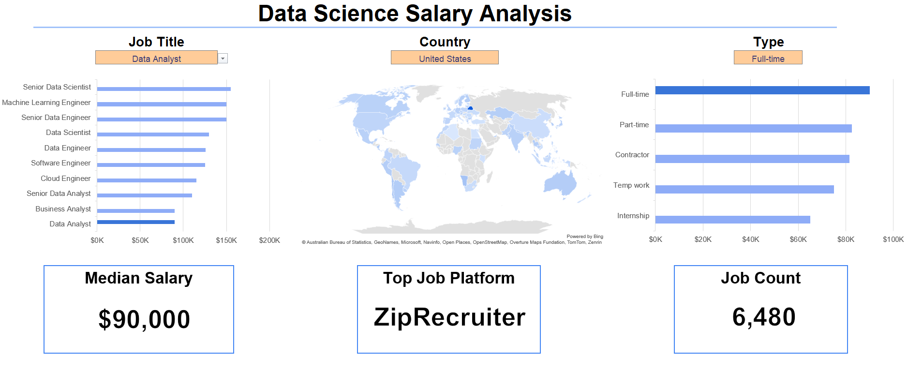

# 📊 Data Science Salary Dashboard

This project is an interactive Excel dashboard designed to analyze global data science job salaries using real-world job posting data from 2023. The dashboard helps users explore salary trends, job roles, countries, employment types, and hiring platforms within the data industry.

The project demonstrates practical Excel skills used in data analytics, including data cleaning, formulas, dashboards, charts, filtering systems, and dynamic visualizations.

---

# 📁 Project File

The final Excel dashboard is located here:

* [Data_Science_Analysis_Dashboard.xlsx](./Data_Science_Analysis_Dashboard.xlsx)

---

# 🛠️ Excel Skills Used

The following Excel features and techniques were used to build this dashboard:

* 📉 **Charts & Visualizations** – Dynamic salary comparison charts and analysis visuals.
* 🧮 **Advanced Formulas** – `MEDIAN()`, `FILTER()`, `COUNTIFS()`, `XLOOKUP()`, `SEARCH()`, `IF()` and array formulas.
* 🎛️ **Interactive Dashboard** – User-controlled filters for Job Title, Country, and Job Type.
* ❎ **Data Validation** – Dropdown-based filtering for better user interaction.
* 📊 **Data Analysis** – Salary trend analysis across different job categories.
* 🧹 **Data Cleaning & Organization** – Structured dataset preparation for accurate insights.

---

# 📂 Dataset Information

The dataset contains over 32,000 real-world data job postings and includes information such as:

* 👨‍💼 Job Titles
* 💰 Average Yearly Salaries
* 🌍 Countries & Locations
* 🕒 Job Schedule Types
* 🏢 Hiring Platforms
* 🛠️ Required Skills
* 🏠 Remote Work Availability
* 🎓 Degree Requirements
* 🏥 Health Insurance Availability

Dataset Sheet: `Data`

---

# 📈 Dashboard Features

## 🎯 Interactive Filters

The dashboard allows users to dynamically filter salary insights based on:

* Job Title
* Country
* Employment Type

This makes the dashboard flexible and easy to explore for different career paths and market trends.

---

# 📉 Dashboard Visualizations

# 🖼️ Dashboard Preview



The dashboard provides an interactive visual analysis of global data science salaries, job platforms, employment types, and country-wise trends.

---

## 💰 Salary Analysis by Job Role

The dashboard compares median salaries for multiple data-related job roles such as:

* Data Analyst
* Data Scientist
* Data Engineer
* Machine Learning Engineer
* Senior Data Scientist
* Senior Data Analyst

### Key Insights:

* Senior-level roles generally offer higher salaries.
* Data Engineering and Machine Learning positions show strong salary growth.
* Analyst roles typically have lower salary ranges compared to engineering and senior positions.

---

## 🌍 Country-Based Salary Analysis

The dashboard analyzes salary differences across countries.

### Key Insights:

* Salary trends vary significantly by region.
* Some countries provide much higher median salaries for specialized data roles.
* Global market demand impacts salary distribution.

---

## 🕒 Employment Type Analysis

Different schedule types were analyzed, including:

* Full-time
* Part-time
* Contractor
* Internship
* Temporary Work

### Key Insights:

* Full-time jobs dominate the dataset.
* Contractor and specialized roles may provide competitive salaries.
* Internship roles generally show lower salary averages.

---

## 🏢 Hiring Platform Analysis

The project also tracks job postings across multiple hiring platforms such as:

* Indeed
* Ai-Jobs.net
* Snagajob
* LinkedIn-related sources

This helps identify which platforms frequently post data-related jobs.

---

# 🧮 Important Excel Formulas Used

## 📌 Median Salary Calculation

```excel
=MEDIAN(
IF(
    (jobs[job_title_short]=A2)*
    (jobs[job_country]=country)*
    (ISNUMBER(SEARCH(type,jobs[job_schedule_type])))*
    (jobs[salary_year_avg]<>0),
    jobs[salary_year_avg]
)
)
```

### Purpose:

* Filters salary data using multiple conditions.
* Calculates the median salary for selected job titles and countries.
* Excludes blank salary values.

---

## 📌 Count Job Platforms

```excel
=COUNTIFS(jobs[job_via],A3,
jobs[job_title_short],title,
jobs[job_country],country,
jobs[job_schedule_type],type)
```

### Purpose:

* Counts job postings based on selected filters.
* Helps analyze platform popularity.

---

## 📌 Dynamic Filtering Formula

```excel
=FILTER(J2#,
(NOT(ISNUMBER(SEARCH("and",J2#))+
ISNUMBER(SEARCH(",",J2#))))*(J2#<>0))
```

### Purpose:

* Generates clean filtered lists.
* Removes invalid or unnecessary values.
* Supports dashboard dropdown selections.

---

# ❎ Data Validation

Dropdown-based data validation was implemented for:

* Job Titles
* Countries
* Job Schedule Types

### Benefits:

* Prevents invalid user inputs.
* Improves dashboard usability.
* Enables smooth interactive filtering.

---

# 📌 Project Objectives

This dashboard was created to:

* Practice real-world Excel data analytics skills.
* Analyze global data science salary trends.
* Build an interactive business-style dashboard.
* Understand salary distribution across roles and countries.
* Strengthen portfolio projects for Data Analyst and Data Science roles.

---

# 🚀 Tools & Technologies

* Microsoft Excel
* Excel Charts
* Excel Formulas
* Data Validation
* Dashboard Design
* Data Cleaning Techniques

---

# 📚 Learning Outcomes

Through this project, the following skills were improved:

* Data cleaning and preprocessing
* Dashboard design principles
* Analytical thinking
* Dynamic filtering systems
* Real-world salary data analysis
* Excel formula optimization
* Data visualization techniques

---

# ✅ Conclusion

This Excel dashboard provides meaningful insights into the global data science job market. By analyzing salaries, job roles, countries, and employment types, users can better understand industry trends and make informed career decisions.

The project also demonstrates strong foundational Excel skills required in Data Analyst and Business Intelligence roles.
